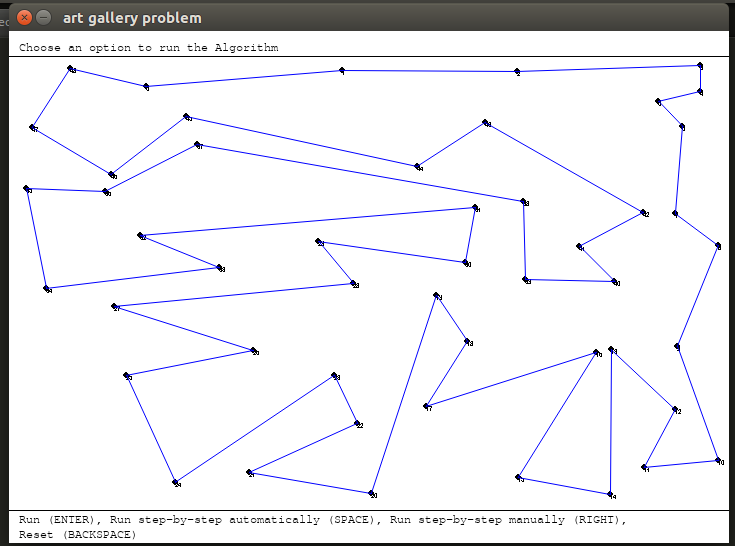
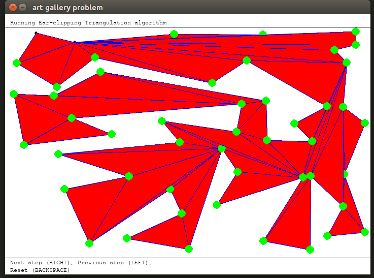
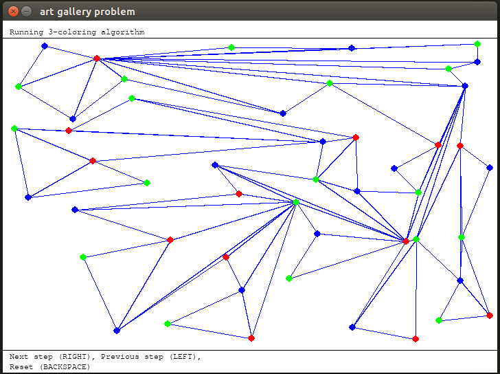
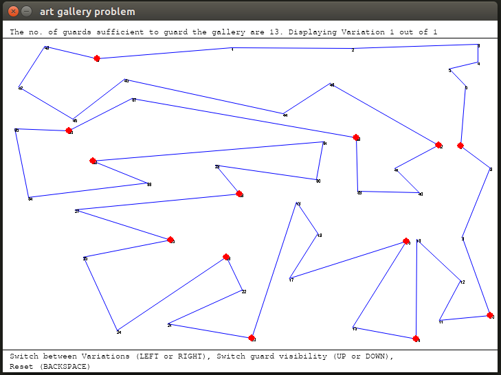
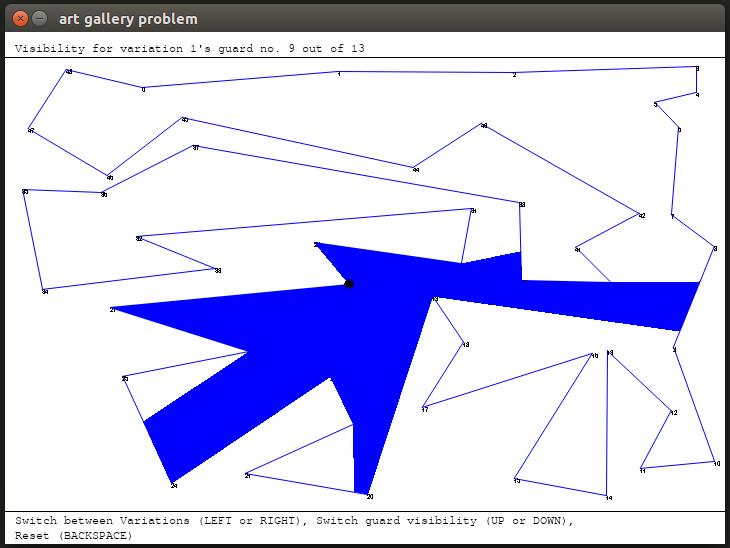

# Art_Gallery_problem
The Art Gallery Problem (AGP) is one of the classic problems in Computational Geometry.
Many variants of these problems have already been studied.In this paper, we propose an algorithm to solve the art gallery problem in which guards are placed on the vertices of the polygon P i.e gallery.

Problem Statement
Guarding an art gallery with the minimum number of guards who can keep a check on the whole gallery.
We have considered the layout of the art gallery be a simple polygon in which guards are to be placed on the vertices of the polygon .
Let a set S of points is said to guard a polygon if, for every point p in the polygon, there is some q ∈ S such that the line joining p and q does not leave the polygon.

IMPLEMENTATION
First we built a polygon and used a graphical user interface to show instructions on how we can use the tool. 
In the design part we also used prev and next buttons where users can navigate and visualize  the implementation.   
We have used the following algorithms in this tool:
• Ear Clipping Algorithm for Triangulation 
• M-coloring using backtracking (3-coloring) 
• Polygon Visibility

Sample input and sample output

Here n=48.We can create polygon of any size and shape.

Results after applying Ear Clipping Algorithm for Triangulation.

3-coloring algorithm

It tells about possible variations of position of guard that can be used to cover whole polygon

It tells about the range uptil a guard can see in one of the optimal variation

Run on Windows

    Download the Art Gallery setup.exe file from the dist folder and run it to install the Art Gallery Tool.
    Run the Art Gallery Tool by executing Art Gallery Pedagogical Tool.exe from desktop shortcut or the location chosen to install the program.

Run on Mac OS, Linux
Requirements

    Python 3+ (Python 3.6)

Python Libraries (use pip to download and install these libraries)

    Pygame (pip3 install pygame or pip install pygame)
    EasyGui (pip3 install easygui or pip install easygui)
    NumPy (pip3 install numpy or pip install numpy)

Steps to run

    Download all Python scripts from scripts folder.
    Open terminal in the folder that contains the scripts.
    Run command python3 ArtGallery.py or python ArtGallery.py to run the tool.

General Instructions for GUI:
    1)Message regarding the program(i.e result,coloring,etc) will be displayed at top of the screen of GUI 
    2)For navigation in GUI the message will be displayed at the bottom of the screen of GUI
    3)Press Esc to exit the GUI screen
Input ways:
    1)Input by mouse cursor
	    *to terminate the creation of polygon press enter.
    2)Input by input file
        While making a input file make sure that the file vertices do make the simple polygon
        eg. input format : x y
            7 8   
            10 50
            45 63
